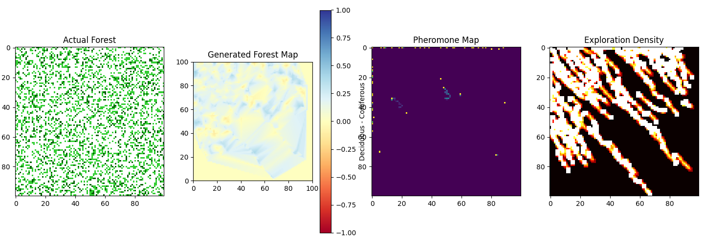

# SIERRA: Swarm Intelligence for Environmental Reconnaissance and Research Assessment

## Overview

SIERRA (Swarm Intelligence for Environmental Reconnaissance and Research Assessment) is an advanced simulation project that models a swarm of drones mapping a forest environment. Using autonomous exploration strategies and swarm intelligence, SIERRA demonstrates how a group of drones can efficiently map and categorize different types of trees in a forest, utilizing concepts such as pheromone trails and collective behavior.

## Features

- Realistic forest environment generation
- Autonomous drone swarm behavior
- Pheromone-based navigation
- Obstacle avoidance
- Dynamic forest mapping
- Visualization of actual forest, generated map, pheromone trails, and exploration density

## Requirements

- Python 3.7+
- NumPy
- Matplotlib
- SciPy

## Installation

1. Clone the repository:
   ```
   git clone https://github.com/heysouravv/SIERRA.git
   ```

2. Navigate to the project directory:
   ```
   cd SIERRA
   ```

3. Install the required dependencies:
   ```
   pip install -r requirements.txt
   ```

## Usage

Run the SIERRA simulation:

```python
python sierra_simulation.py
```

This will execute the simulation and display the results, including visualizations of the actual forest, generated forest map, pheromone map, and exploration density.

## Results and Discussion



Our current results, as shown in the image above, demonstrate the effectiveness of the SIERRA system:

1. **Actual Forest**: 
   The top-left quadrant shows the actual distribution of trees in the simulated forest. Green dots represent trees, with varying shades potentially indicating different types (e.g., deciduous vs. coniferous).

2. **Generated Forest Map**: 
   The top-right quadrant displays the forest map generated by the drone swarm. The blue and yellow areas indicate the drones' interpretation of tree density and types. While not a perfect match to the actual forest, it shows a good approximation of the overall forest structure.

3. **Pheromone Map**: 
   The bottom-left quadrant illustrates the pheromone trails left by the drones. The brighter spots and lines indicate areas of higher drone activity. We can see that the drones have created paths through the forest, but there's room for improvement in coverage.

4. **Exploration Density**: 
   The bottom-right quadrant shows the exploration density. The bright diagonal patterns indicate the paths most frequently taken by the drones. While there's good coverage in some areas, the black spaces reveal unexplored regions, suggesting that our exploration algorithm can be further optimized.

These results are promising for an MVP (Minimum Viable Product) stage, demonstrating the core functionality of forest mapping and swarm behavior. However, they also highlight areas for improvement, such as:

- Enhancing the accuracy of the generated forest map
- Improving the distribution of pheromone trails for more uniform exploration
- Optimizing the exploration algorithm to reduce unexplored areas

## Progress and Future Development

JADE MOORING has made significant progress in developing SIERRA, achieving a Minimum Viable Product (MVP) stage. Here's a review of our accomplishments and future development plans:

Completed:
- [x] Implemented basic forest environment generation
- [x] Developed autonomous drone swarm behavior
- [x] Created a pheromone-based navigation system
- [x] Implemented basic obstacle avoidance
- [x] Developed a dynamic forest mapping algorithm
- [x] Created visualizations for actual forest, generated map, pheromone trails, and exploration density
- [x] Achieved MVP status with demonstrable forest mapping capabilities

TODO:
- [ ] Implement more realistic drone physics (e.g., acceleration, turning radius)
- [ ] Add simulated sensor noise and GPS inaccuracy
- [ ] Incorporate battery life simulation and recharging strategies
- [ ] Improve the accuracy of the generated forest map
- [ ] Implement inter-drone communication for enhanced swarm intelligence
- [ ] Add dynamic obstacles (e.g., moving animals) and weather conditions
- [ ] Optimize exploration algorithms for more uniform coverage
- [ ] Develop a user interface for real-time simulation control
- [ ] Implement 3D visualization of the forest and drone movements
- [ ] Create a module for integrating with real drone hardware APIs
- [ ] Add unit tests and integration tests for core components
- [ ] Optimize performance for larger scale simulations (e.g., using parallel processing)
- [ ] Incorporate machine learning algorithms for improved tree classification
- [ ] Develop a data export feature for analysis in external tools
- [ ] Implement adaptive swarm behavior based on real-time environmental feedback
- [ ] Develop a mission planning module for custom forest survey configurations

JADE MOORING is committed to continually improving SIERRA, addressing these TODO items to enhance its capabilities and real-world applicability.

## Contributing

We welcome contributions to the SIERRA project! If you're interested in improving the simulation or adding new features, please:

1. Fork the repository
2. Create a new branch for your feature
3. Commit your changes
4. Push to your branch
5. Create a new Pull Request

## License

This project is licensed under the MIT License - see the [LICENSE](LICENSE) file for details.

## Acknowledgments

- This project was inspired by cutting-edge research in swarm robotics and forest conservation efforts.
- Special thanks to all contributors and researchers in the fields of swarm intelligence and environmental mapping.